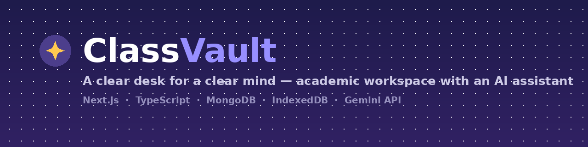
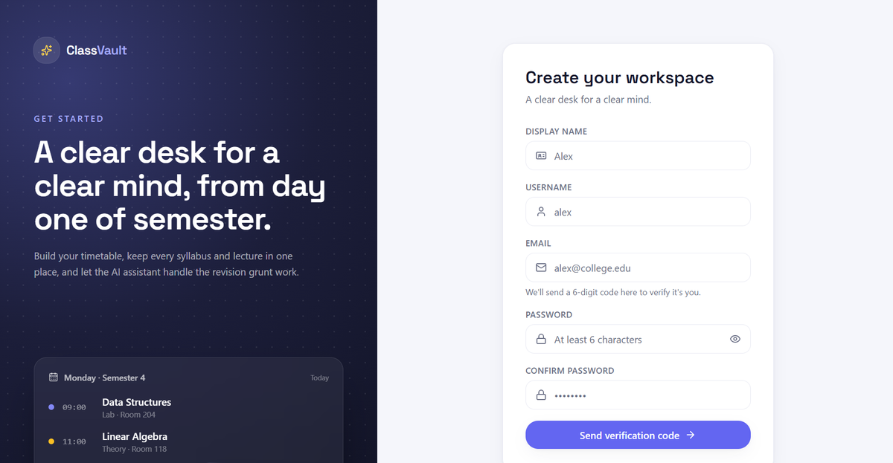
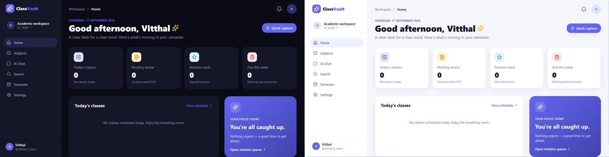
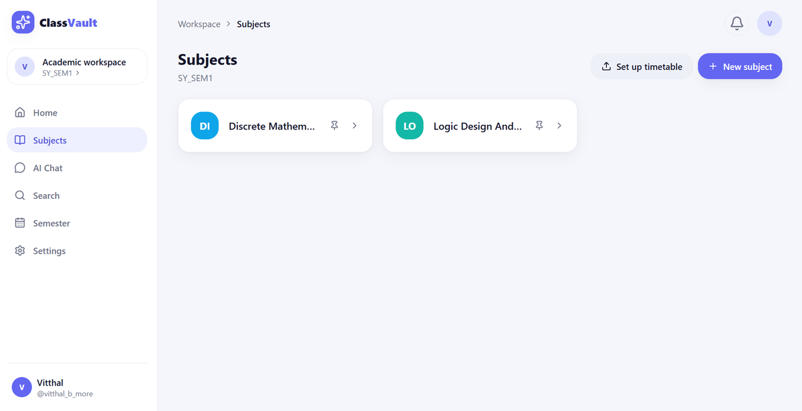
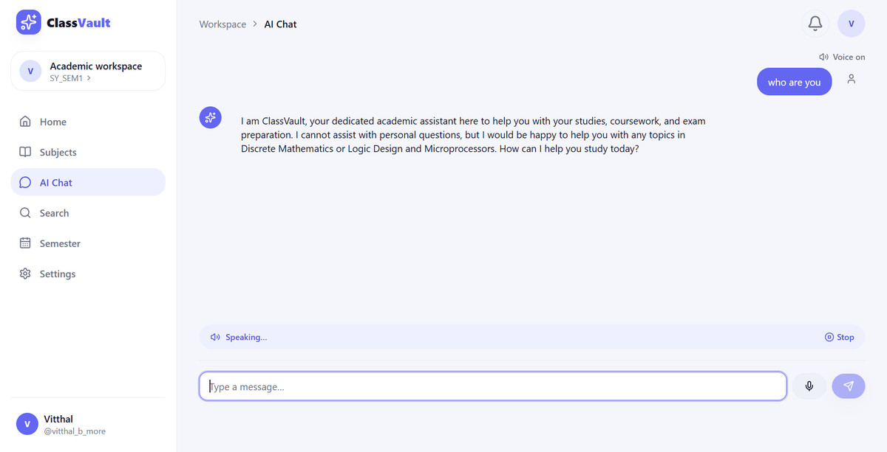
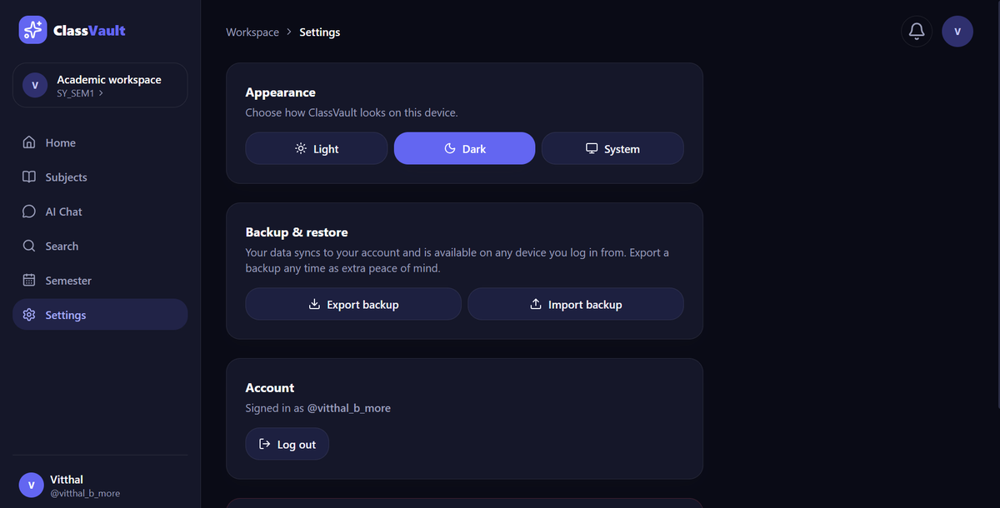

<p align="center">
  
</p>

<h1 align="center">ClassVault — Web</h1>

<p align="center">
  A local-first academic workspace with an AI assistant — semesters, subjects, timetables,
  lecture resources, and notes, all in one place.
</p>

<p align="center">
  <a href="https://classvaultweb-beryl.vercel.app"></a>
  
  
  
  
  
  
</p>

<p align="center">
  <a href="#overview">Overview</a> ·
  <a href="#features">Features</a> ·
  <a href="#screenshots">Screenshots</a> ·
  <a href="#tech-stack">Tech Stack</a> ·
  <a href="#architecture">Architecture</a> ·
  <a href="#getting-started">Getting Started</a> ·
  <a href="#project-layout">Project Layout</a> ·
  <a href="#notes">Notes</a>
</p>

---

## Overview

ClassVault is a web port of the ClassVault mobile app: the same flow and features — semesters → subjects → timetable → syllabus / resources / lectures / assignments / notes → AI chat — rebuilt with **Next.js** for the browser.

It's an academic workspace for organizing everything tied to a semester, with an AI assistant that can explain, summarize, and answer questions grounded in a student's own uploaded material.

The architecture is deliberately **local-first**: almost nothing except login credentials ever touches a server, which keeps the app fast, lets it work offline once loaded, and avoids putting a student's academic material on infrastructure it doesn't need to be on.

**🔗 Live demo:** [classvaultweb-beryl.vercel.app](https://classvaultweb-beryl.vercel.app)

## Features

- 📚 **Semesters → Subjects → Timetable** hierarchy for organizing a full academic term
- 📄 **Resource management** — upload and organize PPTs, Word docs, and PDFs per subject via Cloudinary
- 🔎 **On-device OCR** — extract text from lecture photos (Tesseract.js) and PDFs (pdf.js), entirely in the browser
- 🤖 **AI assistant (Gemini API)** — Explain, Summarize, Key Points, Important Questions, and Generate Notes on any subject, plus a subject-scoped chat and a global assistant
- 🔍 **Cross-content search** across subjects, resources, and notes
- ⭐ **Revision queue** for starred lectures
- 🌗 **Full light/dark theme system** with a user-facing toggle
- 💾 **Local-first data layer (IndexedDB)** — one database per logged-in user, with manual export/import backup from Settings
- 🔐 **JWT-based authentication** backed by MongoDB Atlas — the *only* data that ever reaches the server

## Screenshots

**Onboarding**



**Home dashboard — light & dark themes**



**Subjects**



**AI Chat Assistant**



**Settings — theme control & backup**



## Tech Stack

| Layer | Technology |
|---|---|
| Framework | Next.js (App Router), React, TypeScript |
| Auth | JWT sessions, MongoDB Atlas (Mongoose), bcrypt password hashing |
| Local data | IndexedDB (per-user database) via a typed repository layer |
| File uploads | Cloudinary |
| OCR / text extraction | Tesseract.js (images), pdf.js (PDFs) |
| AI | Google Gemini API (called client-side) |
| Styling | Tailwind CSS |

## Architecture

**What lives where:**

- **Login / signup (username + password)** → stored in **MongoDB Atlas**. This is the *only* thing that touches the database — see `src/lib/models/User.ts` and `src/app/api/auth/*`.
- **Everything else** — semesters, subjects, timetable, syllabus, resources, lectures + OCR text, assignments, notes, chat history, app settings, and uploaded files — is stored **locally in the browser** via IndexedDB, one database per logged-in username (`src/lib/local/db.ts`, `repo.ts`). None of it is ever sent to a server. Use **Settings → Export backup** for a portable JSON copy.
- **OCR / text extraction** runs on-device: Tesseract.js for photos, pdf.js for PDFs (`src/lib/extract.ts`) — mirroring the original mobile app's on-device ML Kit OCR.
- **AI features** (Explain / Summarize / Key Points / Important Questions / Generate Notes, subject-scoped chat, and the global assistant) call the Gemini API directly from the browser (`src/lib/gemini.ts`).

```
┌─────────────┐        JWT auth only        ┌──────────────────┐
│   Browser   │ ───────────────────────────▶│  MongoDB Atlas    │
│             │                              │  (users only)     │
│  ┌────────┐ │        direct API calls      └──────────────────┘
│  │IndexedDB│◀── everything else            ┌──────────────────┐
│  └────────┘ │ ───────────────────────────▶ │   Gemini API      │
│             │                              └──────────────────┘
│  Tesseract.js│ ──────────────────────────▶ ┌──────────────────┐
│  pdf.js      │        file uploads         │   Cloudinary      │
└─────────────┘ ───────────────────────────▶ └──────────────────┘
```

## Getting Started

```bash
npm install
cp .env.example .env.local
```

Edit `.env.local`:

```env
MONGODB_URI=<your MongoDB Atlas connection string>
JWT_SECRET=<any long random string>
NEXT_PUBLIC_GEMINI_API_KEY=<optional — can also be set per-user in Settings>
```

```bash
npm run dev
```

Open [http://localhost:3000](http://localhost:3000) — you'll land on Login/Signup first.

### MongoDB Atlas setup (auth only)

1. Create a free cluster at [mongodb.com/cloud/atlas](https://www.mongodb.com/cloud/atlas).
2. Create a database user and allow network access (`0.0.0.0/0` for quick testing, or your host's egress IPs in production).
3. Copy the connection string into `MONGODB_URI` in `.env.local` (and into your hosting provider's environment variables when you deploy).

The app only ever writes to one collection, `users`, storing a username and a bcrypt password hash — no academic data goes here.

### Gemini API key

Set `NEXT_PUBLIC_GEMINI_API_KEY` in your hosting provider's environment variables. Each user can also override it with their own key in **Settings → Gemini API key**, which always takes priority. No code changes needed either way.

### Deploying

Works on any Next.js host (Vercel, Netlify, Render, your own Node server). For Vercel:

```bash
npm i -g vercel
vercel
```

Set `MONGODB_URI`, `JWT_SECRET`, and (optionally) `NEXT_PUBLIC_GEMINI_API_KEY` in the project's environment variables, then redeploy.

## Project Layout

```
src/
  app/
    login/, signup/            – auth pages
    (app)/                     – authenticated shell (sidebar + topbar)
      home/                    – dashboard
      semester/                – create/switch semesters
      subjects/                – subject list, subject workspace, timetable upload
      ai-chat/                 – global assistant
      search/                  – cross-content search
      revision/                – starred lectures
      settings/                – theme, Gemini key, backup/restore, account
    api/auth/                  – signup/login/logout/me (Mongo-backed)
  components/                  – Sidebar, TopBar, ChatPanel, subject tab components
  lib/
    auth/                      – JWT session + client AuthContext
    db/mongodb.ts              – Mongo Atlas connection (auth only)
    models/User.ts             – Mongoose User model
    local/                     – IndexedDB data layer + typed repositories (everything else)
    gemini.ts, extract.ts      – Gemini client, OCR/PDF text extraction
    timetableParser.ts         – heuristic timetable text parser
```

## Notes

- Since app data lives in IndexedDB, it's per-browser/per-device. There's no cross-device sync (matching the original mobile app's local-first design) beyond manual export/import in Settings.
- `middleware.ts` protects all `(app)` routes behind the login cookie.

## Author

**Vitthal Bhanudas More**

[GitHub](https://github.com/vitthal-hash) · [LinkedIn](https://www.linkedin.com/in/vitthal-more12)
